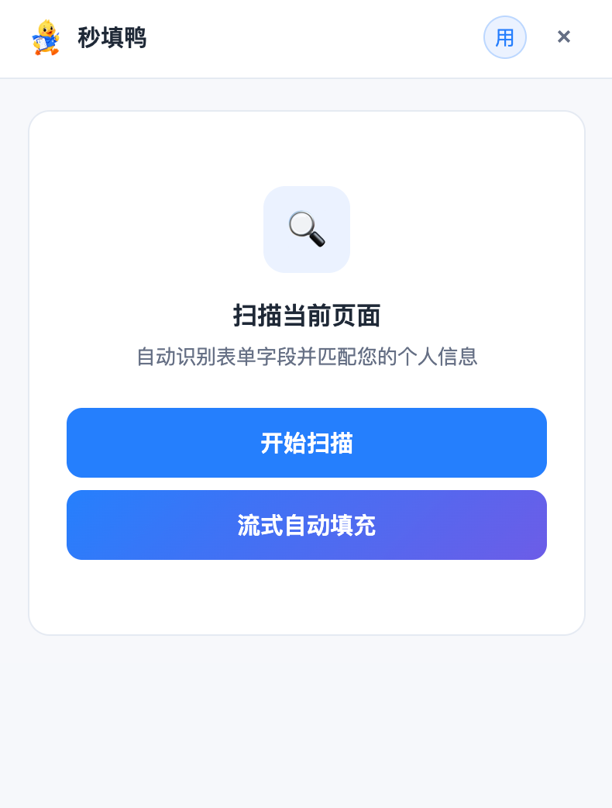
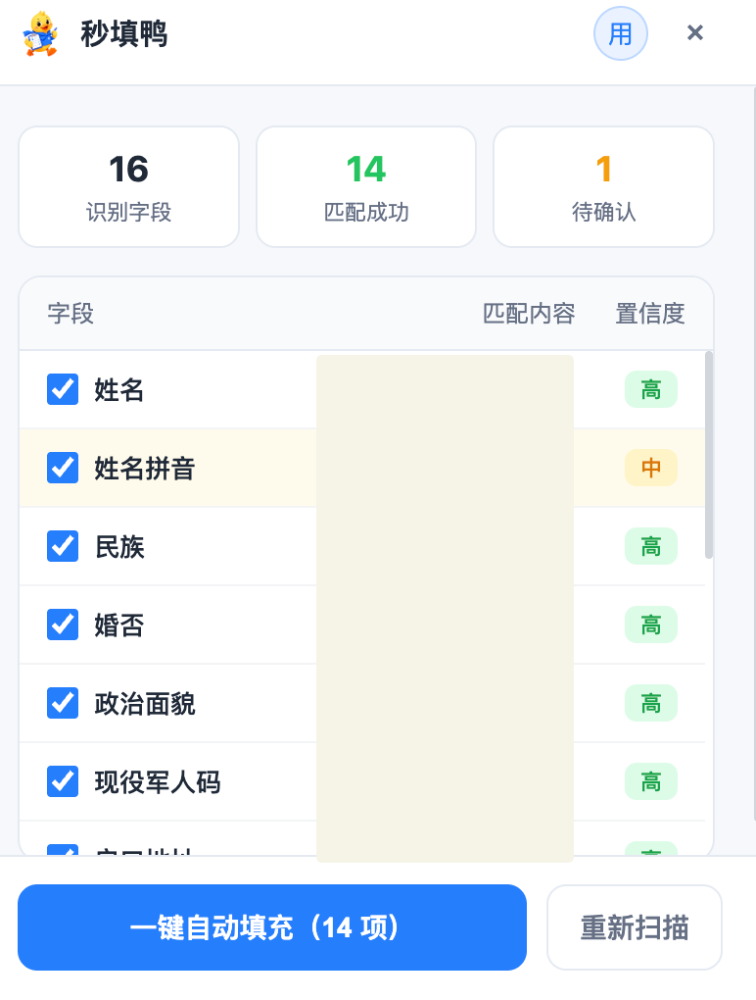
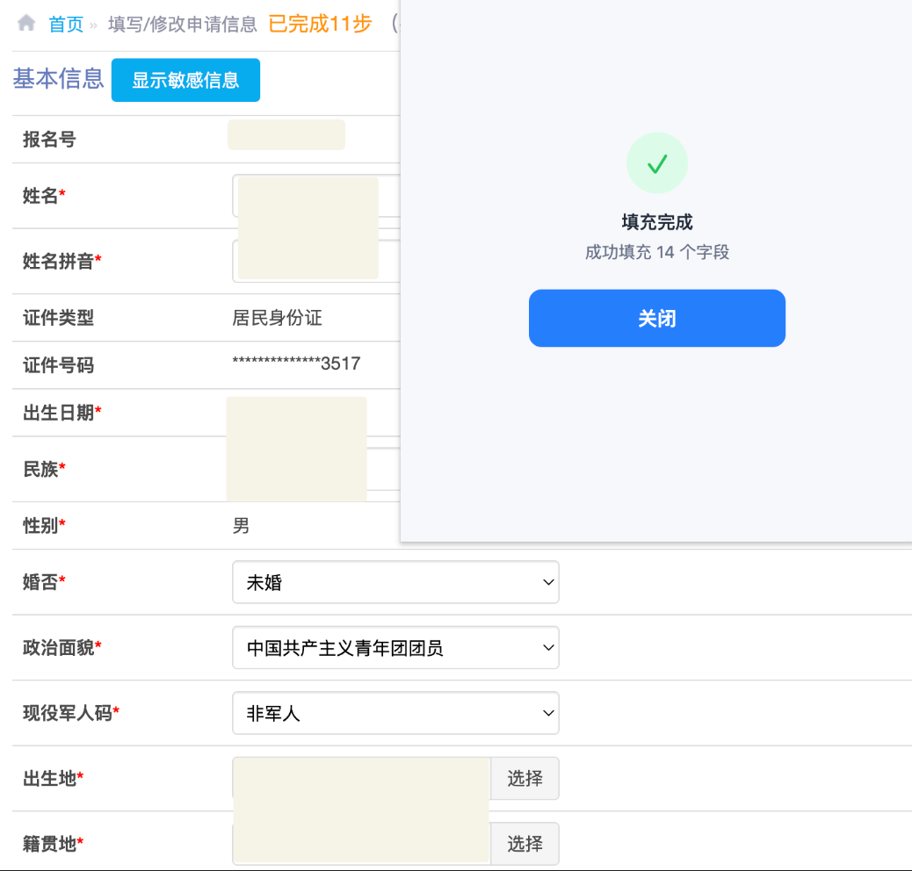

# Auto Filler

English | [中文](README.md)

An LLM-powered semantic matching Chrome extension for automatic web form filling. Supports text field filling and PDF document synthesis. All data stays local — no account required.

<div align="center">
  <a href="../../releases/latest"><b>⬇️ Download & Install</b></a>
</div>

<div align="center">
  
  
  
</div>

## Features

### Smart Form Filling
- Scans form fields (label, placeholder, aria-label, name, id)
- Uses LLM semantic matching to auto-fill fields with your stored personal info
- Works with React and other framework pages (uses native setters to trigger updates)
- Shows confidence scores — review and confirm matches before filling

### Document Management
- Upload images (JPG/PNG/WebP) and PDF files
- Organize documents by category (ID, education, certificates, photos, etc.)
- Preview, rename, move between categories, and delete

### PDF Synthesis
- Select images and PDFs from your documents, drag to reorder, then merge into one PDF
- Upload new files on the fly (auto-saved to your document library)
- Images auto-scale to fit A4 pages, centered with margins
- Merged result saved to your document library for easy download
- Runs entirely in the browser — no server needed

### API Configuration
- Works with any OpenAI-compatible API
- Pre-configured provider presets — just fill in your API key
- Also supports custom Base URL and model name

## Installation

### From Release (Recommended)

Download the zip file from [Releases](../../releases):

| File | Browser |
|------|---------|
| `auto-filler-chrome.zip` | Chrome / Edge / Brave and other Chromium-based browsers |
| `auto-filler-firefox.zip` | Firefox |

**Chrome / Edge:**

1. Open `chrome://extensions/` (or `edge://extensions/`)
2. Enable **Developer mode** in the top-right corner
3. **Drag and drop** the downloaded zip file into the page

**Firefox:**

1. Open `about:debugging#/runtime/this-firefox`
2. Click "Load Temporary Add-on"
3. Select the downloaded zip file (Firefox marks it as temporary — reload after restart)

### Build from Source

```bash
npm install
npm run build            # Chrome
npm run build:firefox    # Firefox
```

The output is in the `.output/` directory. Load it via "Load unpacked" in your browser's extension management page.

### Package

```bash
npm run zip            # Chrome
npm run zip:firefox    # Firefox
```

Output in `.output/`, ready for Chrome Web Store or GitHub Releases.

## Usage

1. **Configure API**: Click the extension icon → Settings → Enter API URL and Key
2. **Add Personal Info**: Fill in your common info (name, phone, email, address, etc.) in the settings page — supports custom fields
3. **Upload Documents**: Upload proof files on the documents page, organized by category
4. **Fill Forms**: Browse a target page → Click the extension icon → Scan → Confirm matches → Fill
5. **Synthesize PDF**: On the PDF page, select documents → Reorder → Merge → Download from your document library

## Tech Stack

- **Framework**: [WXT](https://wxt.dev/) (Vite-based browser extension framework)
- **Language**: TypeScript
- **UI**: Vanilla HTML/CSS, no framework
- **PDF**: [pdf-lib](https://pdf-lib.js.org/)
- **Pinyin**: [pinyin-pro](https://github.com/nicoleee-h/pinyin-pro)
- **Storage**: IndexedDB + chrome.storage.local

## Project Structure

```
├── entrypoints/
│   ├── background.ts        # Service Worker: message routing, LLM calls
│   ├── content.ts           # Content script: DOM scanning, form filling
│   ├── popup/               # Popup: scan → confirm → fill
│   └── options/             # Options page: info management, documents, PDF, settings
├── utils/
│   ├── db.ts                # IndexedDB wrapper
│   ├── storage.ts           # chrome.storage wrapper
│   ├── matcher.ts           # LLM semantic matching
│   ├── pdf-merge.ts         # PDF merge logic
│   └── providers.ts         # API provider presets
└── public/icons/            # Static icon assets
```

## Development

```bash
npm run dev              # Chrome dev mode (HMR)
npm run dev:firefox      # Firefox dev mode
npm run compile          # Type check only
```

## TODO

- **Import/Export personal info**: Export personal info as JSON for backup and migration across devices
- **Cloud sync**: Sync personal info and documents via WebDAV or similar protocols for multi-device access
- **Auto-import personal info**: Scan form fields and automatically add unmatched fields to your personal info library
- **Visual drag-and-drop upload**: Floating window or dialog for manually dragging documents into page file upload areas

## License

Licensed under the [Apache License 2.0](LICENSE).
